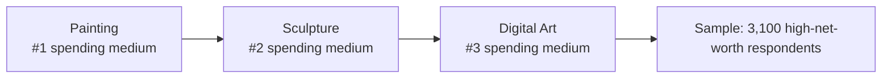
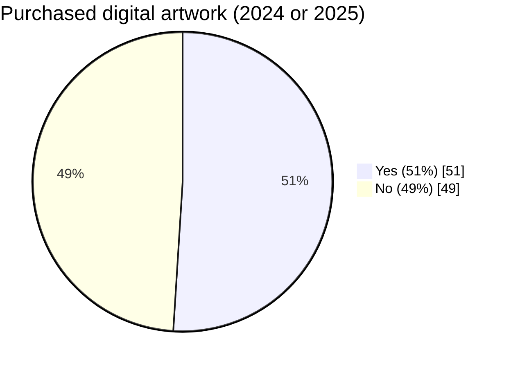
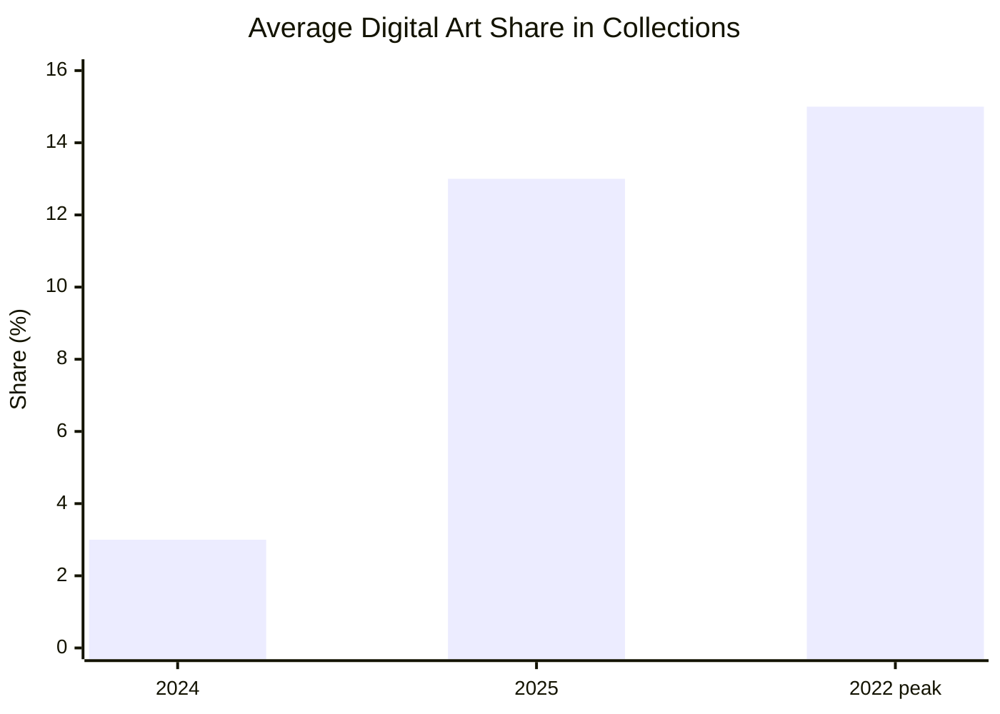

## New Media
#### WEEK 14

::note:: 
Monday, April 6, 2026

---

## New Media Art / Digital Art ✏️

<!-- 
Art forms using digital technologies have been around for more than half a century.

- Originally referred to as computer art, then multimedia art and cyberarts (1960s–1990s)
- became digital art or so‐called new media art at the end of the 20th century. 
  
new media art is a term that emerged in the late 1990s to describe a wide range of artistic practices that utilize digital technologies, including computer graphics, virtual reality, interactive installations, and internet-based art. The term was popularized as artists began to explore the creative possibilities of emerging technologies and the internet, leading to a new wave of artistic expression that challenged traditional notions of art and its relationship to technology.

The problematic qualifier of the **“new”** always implies its own integration, datedness, and obsolescence and, at best, leaves room for accommodating the latest emerging technologies. 

The terms “digital art” and “new media
art” are sometimes used interchangeably, but new media art is also often understood
as a subcategory of a larger field of digital art that comprises all art using digital technologies
at some point in the process of its creation, storage, or distribution.

 -->

---

### Digital Art Goes Mainstream
#### Art Basel & UBS Survey of Global Collecting 2025

Takeaway: Digital art moved from hype-cycle volatility to sustained mainstream collecting.

<!-- 

According to The Art Basel and UBS Survey of Global Collecting 2025, digital art as a medium ranked third in the total spending of the 3,100 high-net-worth respondents, after painting and sculpture, with more than half (51%) purchasing a digital artwork in 2024 or 2025. After years of fluctuation, reaching a peak of 15% during the NFT boom of 2022, the average share of digital art in collections increased from 3% in 2024 to 13% in 2025.

digital art goes mainstream : https://www.artbasel.com/stories/digital-art-boom-gen-z-collectors

-->

---

<!-- 

source: https://www.sothebys.com/en/articles/artificial-intelligence-and-the-art-of-mario-klingemann
-->

---

<!-- 

Artist Trevor Paglen introduces his work with the simple, and yet seemingly unanswerable question, “What does the internet look like?” Through varying mediums, Paglen gives tangible form to what usually feels both all-consuming and still impalpable: the internet, surveillance, satellite transmission, machine vision, data collection. His works on view now at the Institute of Contemporary art/Boston in Art in the Age of the Internet, 1989 to Today are the perfect example.

The first, titled Autonomy Cube, sits in a gallery of the museum that boosts floor to ceiling windows overlooking Boston harbor, an onslaught of light, water, and the ‘real world.’ An elegant glass cube, mounted on a minimal pedestal, shrouds computer components at shoulder height. To a neophyte it looks like the inside of a laptop, a collection of wires and plates, that signature green of technology. In fact, it is a functioning Tor router, a way to connect to Wi-Fi and then anonymously browse the internet. Routers such as this are used for nefarious purposes worldwide, but in this current moment also speaks to a more universal desire for anonymity and freedom of expression. This piece speaks to another one of Paglen’s abstract and challenging, but absurdly prevalent questions. What if we built an internet that didn’t spy on us?

The other two pieces on view in this exhibition are large, beautiful photographs. While they seem almost phantasmal, their titles give them away as in fact materially linked to the twenty first century human experience. For instance, NSA-Tapped Undersea Cables, North Pacific Ocean, is a color print photography of the material infrastructure of the internet. The second, RAVEN 2 in Corona Borealis (Signals Intelligence Satellite; USA 200), is a picture of a satellite orbiting our planet and transmitting telecommunications that allow our world to work the way it does. Appropriately, these works sit within a chapter of the landmark exhibition titled States of Surveillance, addressing the tension of things being beautiful, while not necessarily being ‘good.’

source: https://www.bostonartreview.com/read/internet-view-trevor-paglen-ica

-->

---
color: black
---

<Youtube id="H9wr2hx1PY0" w-full h-full />

Refik Anadol. Unsupervised — Machine Hallucinations — MoMA. 2022

<!-- 
SPEAKER NOTES (presentation-friendly)

Who is the artist?
- Refik Anadol (b. 1985), Turkish-American media artist.
- Director of Refik Anadol Studio (Los Angeles).
- Works across art, architecture, data, and AI.

What are we looking at?
- Unsupervised (2022), shown at MoMA, is part of Machine Hallucinations.
- The larger project (started in 2016) explores collective visual memory through data.
- Anadol treats machine intelligence as a collaborator, not just a tool.

How is it made?
- Studio uses large digital archives and public datasets.
- Models used across the project include DCGAN, PGAN, StyleGAN, and here StyleGAN2 ADA.
- For Unsupervised, the system processed 138,151 pieces of metadata from MoMA's collection.
- The model learned from subsets of MoMA artworks and generated 1024-dimensional embeddings.
- Images were clustered into thematic groups to map semantic relationships.

Why does this matter art-historically?
- The dataset spans 200+ years of art: painting, photography, design objects, even video games.
- The work reframes the museum archive as a "latent cosmos" of possible images.
- It resonates with earlier modern strategies (for example Surrealist automatism, chance, and systems).

Research + creativity
- This project also extends machine-learning research in public cultural contexts.
- Anadol has collaborated with researchers including Jaakko Lehtinen (NVIDIA Research).
- Lehtinen highlighted how advances in difficult ML problems can unexpectedly enable new creativity.

How to read the visuals on screen
- These abstract forms come from unsupervised learning over the museum archive.
- Motion in color and shape traces movement through latent space.
- Edge-detection and color-density mapping visualize links between prior/next latent coordinates.
- In Anadol's framing, we are watching the machine's "unconscious decisions" become visible.

Closing line
- Unsupervised turns a canonical museum collection into a living, generative system where art history, data science, and machine imagination meet.

 -->

---