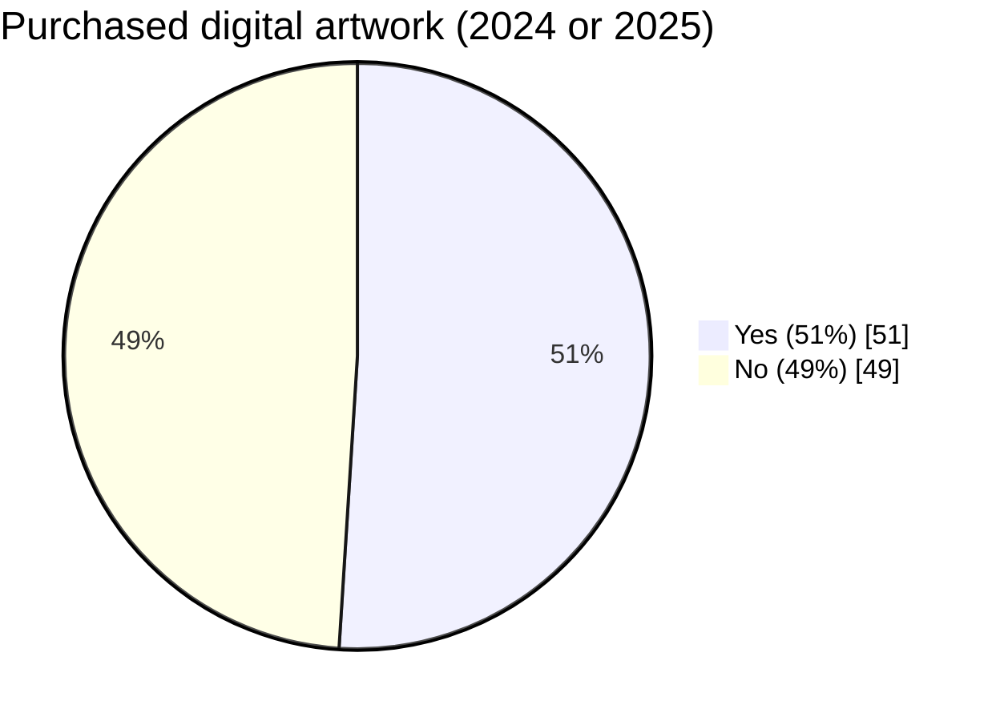
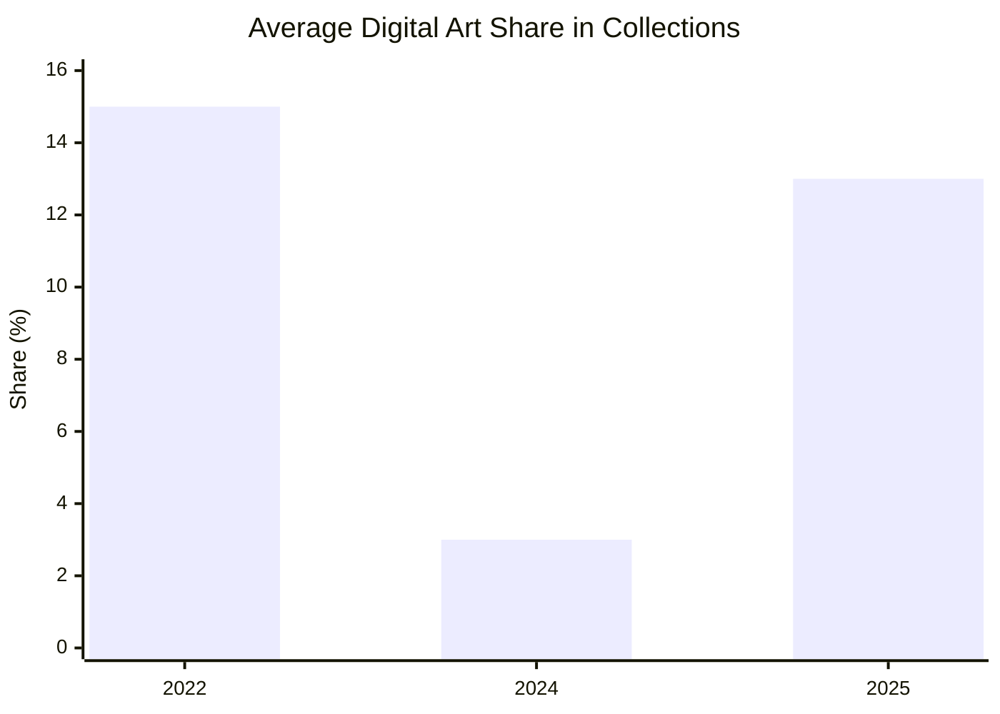
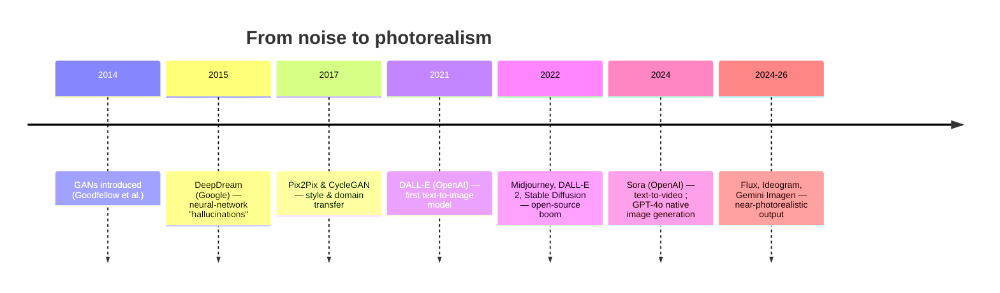

## From Digital Art to the 'AI Slop'
#### WEEK 14

::note:: 
Monday, April 6, 2026

---
title: "New Media Art: definition"
level: 4
layout: center
color: indigo-light
---

## New Media Art / Digital Art ✏️

<!-- 
Art forms using digital technologies have been around for more than half a century.

- Originally referred to as computer art, then multimedia art and cyberarts (1960s–1990s)
- became digital art or so‐called new media art at the end of the 20th century. 
  
new media art is a term that emerged in the late 1990s to describe a wide range of artistic practices that utilize digital technologies, including computer graphics, virtual reality, interactive installations, and internet-based art. The term was popularized as artists began to explore the creative possibilities of emerging technologies and the internet, leading to a new wave of artistic expression that challenged traditional notions of art and its relationship to technology.

The problematic qualifier of the **“new”** always implies its own integration, datedness, and obsolescence and, at best, leaves room for accommodating the latest emerging technologies. 

The terms “digital art” and “new media
art” are sometimes used interchangeably, but new media art is also often understood
as a subcategory of a larger field of digital art that comprises all art using digital technologies at some point in the process of its creation, storage, or distribution.

One needs to distinguish between art that uses digital technologies as a
tool for the production of a more traditional art object—such as a photograph, print, or
sculpture; and the digital‐born art that employs these technologies as a tool for the creation
of a less material, software‐based form that utilizes the digital medium’s inherent characteristics,such as its participatory and generative features
 -->

---
layout: two-cols-title
columns: is-5
---

:: title ::

### Digital Art Goes Mainstream
#### Art Basel & UBS Survey of Global Collecting 2025

:: left :: 

:: right ::

Takeaway: Digital art moved from hype-cycle volatility to sustained mainstream collecting.

<!-- 

According to The Art Basel and UBS Survey of Global Collecting 2025, digital art as a medium ranked third in the total spending of the 3,100 high-net-worth respondents, after painting and sculpture, with more than half (51%) purchasing a digital artwork in 2024 or 2025. After years of fluctuation, reaching a peak of 15% during the NFT boom of 2022, the average share of digital art in collections increased from 3% in 2024 to 13% in 2025.

digital art goes mainstream : https://www.artbasel.com/stories/digital-art-boom-gen-z-collectors

-->

---
hide: true
---

<!-- 

source: https://www.sothebys.com/en/articles/artificial-intelligence-and-the-art-of-mario-klingemann
-->

---
title: "ARPANET"
level: 4
---

### From The ARPANET to the World Wide Web

<!-- 

### A Quick History of the Internet
- The ARPANET, developed in the late 1960s by the U.S. Department of Defense's Advanced Research Projects Agency (ARPA), is widely considered the precursor to the modern internet. It was designed to enable communication between computers at different research institutions and government agencies.
- During the 1970s artists
started using “new technology” such as video and satellites to experiment with “live
performances” and networks that anticipated the interactions that would later take
place on the World Wide Web.
- In 1989, Tim Berners-Lee invented the World Wide Web while working at CERN. The web made the internet accessible to the general public by introducing a user-friendly interface and the concept of hyperlinks, allowing users to easily navigate between different web pages.
- The 1990s saw the rise of the dot-com boom, with the proliferation of websites and online services. This era also marked the emergence of early digital art and net art, as artists began to explore the creative possibilities of the internet as a medium for artistic expression.

-->

---

<!--
SPEAKER NOTES (presentation-friendly)

Who is the artist?
- Trevor Paglen (b. 1974), American artist and geographer.
- Trained as a geographer and photographer; PhD in geography from UC Berkeley.
- His work spans photography, sculpture, and installation — all focused on making invisible systems visible: surveillance, classified networks, machine vision, orbital infrastructure.

What are we looking at?
- Autonomy Cube, 2014. A sleek plexiglass cube (35 x 35 x 35 cm) mounted on a pedestal.
- Inside: computer components — wires, circuit boards. It looks like the guts of a laptop.
- But it is not a static sculpture — it is a *functioning Tor router*.

What does it do?
- It creates a Wi-Fi hotspot anyone can connect to.
- Traffic is routed through the Tor network, anonymizing the user’s browsing.
- Tor (The Onion Router) bounces data through multiple encrypted relays worldwide, making surveillance extremely difficult.
- The cube also provides a *transparent view* of the Tor relay’s activity — visitors can see data flowing through the network in real time.

Why does this matter?
- Paglen asks: “What does the internet look like?” and “What if we built an internet that didn’t spy on us?”
- The work is both an artwork and a working privacy tool — it collapses the distinction between aesthetic object and functional technology.
- It gives tangible, physical form to something — the internet, surveillance — that usually feels invisible and abstract.
- The glass cube is deliberate: transparency as both material and metaphor. You can see the hardware; you can see the data flow. No secrets.

Context within the exhibition
- Shown at ICA Boston as part of *Art in the Age of the Internet, 1989 to Today* (2018).
- Sat in a gallery with floor-to-ceiling windows overlooking Boston Harbor — the “real world” of light, water, and physical space visible right behind the sculpture of digital infrastructure.
- Nearby works included Paglen’s photographs of NSA-tapped undersea cables and surveillance satellites — images that are formally beautiful but document disturbing realities.

Closing thought
- Autonomy Cube asks us to imagine an alternative internet — one built on autonomy and privacy rather than extraction and surveillance. It is art that does not just represent an idea but actively performs it.

Source: bostonartreview.com/read/internet-view-trevor-paglen-ica
-->

---
layout: two-cols
---

:: left ::

:: right ::

---
color: black
---

<Youtube id="H9wr2hx1PY0" w-full h-full />

Refik Anadol. Unsupervised — Machine Hallucinations — MoMA. 2022

<!-- 
SPEAKER NOTES (presentation-friendly)

Who is the artist?
- Refik Anadol (b. 1985), Turkish-American media artist.
- Director of Refik Anadol Studio (Los Angeles).
- Works across art, architecture, data, and AI.

What are we looking at?
- Unsupervised (2022), shown at MoMA, is part of Machine Hallucinations.
- The larger project (started in 2016) explores collective visual memory through data.
- Anadol treats machine intelligence as a collaborator, not just a tool.

How is it made?
- Studio uses large digital archives and public datasets.
- Models used across the project include DCGAN, PGAN, StyleGAN, and here StyleGAN2 ADA.
- For Unsupervised, the system processed 138,151 pieces of metadata from MoMA's collection.
- The model learned from subsets of MoMA artworks and generated 1024-dimensional embeddings.
- Images were clustered into thematic groups to map semantic relationships.

Why does this matter art-historically?
- The dataset spans 200+ years of art: painting, photography, design objects, even video games.
- The work reframes the museum archive as a "latent cosmos" of possible images.
- It resonates with earlier modern strategies (for example Surrealist automatism, chance, and systems).

Research + creativity
- This project also extends machine-learning research in public cultural contexts.
- Anadol has collaborated with researchers including Jaakko Lehtinen (NVIDIA Research).
- Lehtinen highlighted how advances in difficult ML problems can unexpectedly enable new creativity.

How to read the visuals on screen
- These abstract forms come from unsupervised learning over the museum archive.
- Motion in color and shape traces movement through latent space.
- Edge-detection and color-density mapping visualize links between prior/next latent coordinates.
- In Anadol's framing, we are watching the machine's "unconscious decisions" become visible.

Closing line
- Unsupervised turns a canonical museum collection into a living, generative system where art history, data science, and machine imagination meet.

 -->

---

<!--
SPEAKER NOTES (presentation-friendly)

Transition from previous slides
- We just saw Paglen's Autonomy Cube and Haacke's Condensation Cube — two works that make invisible systems visible. Both use enclosure and transparency as aesthetic strategies.
- Now we shift from the digital network back to the body — or rather, to a machine that behaves like a body under duress.

Who are the artists?
- Sun Yuan (b. 1972) and Peng Yu (b. 1974), Beijing-based duo.
- Known for confrontational installations using real materials — human fat, live animals, taxidermy, and industrial machinery.
- Their work often tests the boundary between cruelty and empathy, the mechanical and the organic.

What are we looking at?
- Can't Help Myself, 2016–2019. A single KUKA industrial robot arm inside a transparent enclosure.
- The arm endlessly sweeps a dark-red, blood-like fluid (cellulose ether) back toward its base.
- Four overhead cameras detect spills and dispatch the arm. It never stops.

What makes it uncanny?
- When idle, the arm performs 32 programmed "dances" — a little shimmy, jazz hands, a bow and shake.
- These gestures are eerily human, almost playful — viewers instinctively project personality and emotion onto the machine.
- Over time the spills accumulate faster than the arm can manage. The task becomes truly Sisyphean. Playful turns exhausting. The dance becomes desperate labor.

What happened to it?
- Commissioned by the Guggenheim for *Tales of Our Time* (2016–17). Later shown at the Venice Biennale 2019.
- The artists deliberately shut it down in 2019 — not because it broke, but as a conscious act.
- The shutdown was a metaphor: a call to halt technological violence and break free from Sisyphean monotony.

Key themes to discuss
- Border violence & surveillance: the cameras and confined enclosure echo industrialized border control. The red fluid reads as blood — the collateral damage of that violence.
- Anthropomorphism & empathy: we can't help but feel for the machine. The title works on two levels — the robot "can't help itself," and we can't help empathizing with it.
- Social-media afterlife: after 2023, TikTok and Instagram reframed the piece as an allegory for working-to-live. The robot became all of us — perpetually cleaning up just to survive, until someone else pulls the plug.

Transition to next section
- From here we move from embodied, physical AI to the visual culture of AI generation — how machines started making images on their own, and what happened when they flooded the internet.
-->

---

<Box p-2 v-drag="[34,68,322,101]" v-click>

### Post-Digital / Post-Internet Art
</Box>

<!--
Transition
- From Anadol's data-driven AI environments and Sun Yuan & Peng Yu's robotic body, we now turn to an artist who makes the architecture of networks physically tangible.

What is post-digital / post-Internet art?
- "Post-Internet" doesn't mean "after the Internet is gone." It means the Internet is so pervasive it no longer needs to be the subject — it's the air artists breathe.
- Artworks are conceptually shaped by digital culture and networks, yet often manifest as paintings, sculptures, or installations — deeply material objects with digital DNA.
- The term emerged in the late 2000s; key figures include Artie Vierkant, Marisa Olson, and the circle around the New Museum's 2015 Triennial "Surround Audience."

What are we looking at?
- 14 Billions (2009) by Tomás Saraceno (b. 1973, Argentina; trained as an architect).
- It is NOT a cloud of spheres — it is a monumental reconstruction of a spider web, scaled up to fill an entire gallery.
- Saraceno collaborated with arachnologists to study how spiders spin silk, then reconstructed and enlarged the web using elastic cords and black box clamps.
- Visitors walk through and experience the network from within.

Why "14 Billions"?
- Refers to the approximate age of the universe in years.
- Links the micro-architecture of a spider web to the macro-structure of the cosmos.
- Both are networks — self-organizing, resilient, shaped by invisible forces.

Why is this post-Internet art?
- The work's logic is network logic: nodes, links, emergent structure — the same topology as the Internet.
- Saraceno treats scientific data as raw material, the way digital artists treat code and datasets.
- It translates a digital-era sensibility — interconnectivity, distributed systems — into a deeply physical, tactile experience.

Closing thought
- Saraceno takes the invisible structure of networks and makes it something you can touch, walk through, and get lost in. Next we'll see how he extends this into floating, inhabitable architectures.
-->

---

<Youtube id="G_3luQuhTro" w-full h-full />

Tomás Saraceno, _On Space Time_ Foam, 2012

<!--
SPEAKER NOTES (presentation-friendly)

Transition from previous slide
- In 14 Billions, Saraceno enlarged a web to gallery scale. In this next work, he suspends people inside the network itself.

Who is the artist?
- Tomás Saraceno (b. 1973, Tucumán, Argentina). Trained as an architect.
- His practice explores lighter-than-air structures, atmospheric habitats, and speculative futures for living beyond Earth.
- Inspired by Buckminster Fuller's utopian geodesic domes and the idea of "Spaceship Earth."

What are we looking at?
- On Space Time Foam (2012), commissioned by HangarBicocca, Milan.
- A multi-layered habitat of transparent membranes suspended 24 meters above the ground.
- Visitors can step onto the layers — their weight and movement reshape the structure in real time.
- The form is continuously shaped and reshaped by the people inside it.

How to read it
- It visualizes the idea that space and time are not fixed — they bend and deform around bodies and forces.
- Each membrane layer is like a dimension or plane of reality; bodies create gravity wells that distort the surface.
- The title riffs on quantum physics: "spacetime foam" is the hypothetical structure of space at the Planck scale, where quantum fluctuations make geometry turbulent.

Connection to the previous slide
- 14 Billions showed a network you walk through. On Space Time Foam makes you part of the network — your body becomes a node that deforms the whole system.
- Both works embody Saraceno's core idea: we live inside structures (webs, atmospheres, networks) that we also shape.

Closing thought
- Saraceno asks: what if we lived in the air, not on the ground? What if architecture were as light and adaptive as a soap bubble? This is utopia made physical — fragile, beautiful, and slightly terrifying.
-->

---

<!--
SPEAKER NOTES (presentation-friendly)

Transition
- Saraceno made networks physical and inhabitable. Now we see a very different strategy: an artwork that exists purely as a circulating digital sign — a character with no soul, bought and set free.

What is the project?
- No Ghost Just a Shell (1999–2002), initiated by Philippe Parreno and Pierre Huyghe.
- They bought the copyright to a cheap manga character called "Annlee" from Kworks, a Japanese stock-figure agency.
- Kworks produces generic characters for cartoons, comics, advertising, video games. Annlee had no personality, no backstory — she was cheap and destined to disappear quickly. "True heroes are rare and extremely expensive."

What did they do with her?
- They invited a roster of artists — Liam Gillick, Dominique Gonzalez-Foerster, Rirkrit Tiravanija, M/M Paris, Melik Ohanian, and others — to use Annlee freely.
- Each artist created their own work: video animations, paintings, posters, neon works, sculptures.
- The same empty shell was filled with different subjectivities — each contribution became "a chapter in the history of a sign."

The liberation contract
- After the exhibition tour (Kunsthalle Zürich, ICA Cambridge, SFMOMA), Parreno and Huyghe transferred the copyright to Annlee herself.
- She was freed from both commercial and artistic exploitation.
- Joe Scanlan even built her an IKEA coffin — a memorial for a sign that had finally been laid to rest.

Why does this matter for post-Internet art?
- Annlee is a digital-born entity — a raw 3D model, a sign without character — circulating across artists, venues, and contexts.
- The project's logic mirrors how content moves through networks: copied, remixed, recontextualized, stripped of authorship.
- It anticipated the debates we now have about AI-generated characters, deepfakes, and digital identity — who owns a digital persona? Who controls its circulation?
- The exhibition was conceived as production, not presentation — a relational system, not a display of objects. This approach anticipates much post-internet curatorial practice.

Closing thought
- The title says it all: no ghost, just a shell. In 1999, Annlee was a prophesy of the digital age — empty signs circulating at scale. Today, with AI slop and generated avatars, she looks more relevant than ever.
-->

---
layout: top-title
color: cyan-light
title: "AI & Image Generation: A Brief History"
level: 4
---

:: title ::
### AI & Image Generation: A Brief History

:: content ::

<!--

2014 — Ian Goodfellow introduces Generative Adversarial Networks (GANs): two neural networks compete (generator vs. discriminator), producing increasingly convincing synthetic images.

2015 — Google's DeepDream amplifies patterns already "seen" by a neural net, creating psychedelic, hallucinatory visuals. Goes viral as the first widely seen AI art.

2017 — Pix2Pix and CycleGAN enable image-to-image translation (e.g., sketches → photos, horses → zebras). Opens the door to style transfer as a creative tool.

2021 — OpenAI releases DALL-E (named after Dalí + WALL-E): the first model that generates images from natural-language text prompts. 12 billion parameters.

2022 — The breakthrough year. Midjourney launches in beta (artistic, painterly aesthetic). DALL-E 2 adds much higher resolution and editability. Stable Diffusion goes open-source, democratizing access.

2023–25 — Rapid iteration: DALL-E 3 (integrated into ChatGPT), Flux (open-source, high quality), Ideogram (strong text-in-image rendering). Output quality now near-indistinguishable from photography in many cases.

2024 — Two watershed moments. (1) OpenAI launches Sora, a text-to-video model generating up to 60-second clips from text — the medium jumps from still images to video. (2) GPT-4o introduces native image generation directly in chat, blurring the line between language model and image model.

2024–26 — The field keeps accelerating: Flux refines open-source quality, Google's Gemini integrates Imagen 3, and smaller/faster models (nano variants) make generation near-instantaneous. AI-generated images are now commonplace in advertising, social media, and design workflows.

Key question for discussion: At what point does the prompt become the artwork? Who is the artist — the model, the trainer, or the prompter?

-->

---
level: 4
layout: center
color: fuchsia-light
class: px-16
---

## "Slop" was named the Word of the Year for 2025.  

<!--
- Merriam-Webster has named "slop" its 2025 Word of the Year, defining it as low-quality, AI-generated digital content produced in high volume. The term reflects growing frustration with the proliferation of junk AI, including, but not limited to, absurd videos, fake news, and misleading advertising imagery. 

### details
Merriam-Webster’s human editors have chosen slop as the 2025 Word of the Year. We define slop as “digital content of low quality that is produced usually in quantity by means of artificial intelligence.” All that stuff dumped on our screens, captured in just four letters: the English language came through again.

The flood of slop in 2025 included absurd videos, off-kilter advertising images, cheesy propaganda, fake news that looks pretty real, junky AI-written books, “workslop” reports that waste coworkers’ time… and lots of talking cats. People found it annoying, and people ate it up.

“AI Slop is Everywhere,” warned The Wall Street Journal, while admitting to enjoying some of those cats. “AI Slop Has Turned Social Media Into an Antisocial Wasteland,” reported CNET.

Like slime, sludge, and muck, slop has the wet sound of something you don’t want to touch. Slop oozes into everything. The original sense of the word, in the 1700s, was “soft mud.” In the 1800s it came to mean “food waste” (as in “pig slop”), and then more generally, “rubbish” or “a product of little or no value.”

In 2025, amid all the talk about AI threats, slop set a tone that’s less fearful, more mocking. The word sends a little message to AI: when it comes to replacing human creativity, sometimes you don’t seem too superintelligent.
-->

---
layout: quote
color: cyan-light
author: "Michael G Wagner"
---

... ‘slop’ is the advanced iteration of internet spam: low-quality text, videos and images generated by AI.

<!--
SPEAKER NOTES (presentation-friendly)

Transition
- Merriam-Webster just declared "slop" the 2025 Word of the Year. But what exactly does it mean — and where did the term come from?

The quote on screen
- Michael G. Wagner nails it: slop is "the advanced iteration of internet spam." Not just bad art — automated, industrial-scale junk.
- The word evokes pig slop — something dumped en masse with no refinement.

Where did the term come from?
- Early 2020s: image and text generators start flooding platforms with low-quality content.
- 2022: the term "slop" appears on 4chan and Hacker News, reacting to the first wave of AI art generators.
- 2024: goes mainstream. Tech commentator Simon Willison popularizes it to describe the glut of AI outputs.
- 2025: Merriam-Webster makes it official — Word of the Year.

What counts as slop?
- AI-generated media characterized by an inherent lack of effort, logic, or purpose.
- Absurd videos, fake news, cheesy propaganda, junky AI-written books, engagement-bait images — and lots of talking cats.
- People find it annoying, and people eat it up.

Why does the word matter?
- It sets a tone that's less fearful, more mocking. Instead of catastrophizing about AI, "slop" dismisses it with contempt and humor.
- The message to AI: when it comes to replacing human creativity, sometimes you don't seem too superintelligent.

Closing thought
- Slop is the digital equivalent of junk food — cheap, mass-produced, everywhere. But as we'll see, that raises a question: is it really so different from earlier forms of mass culture that were also dismissed as trash?
-->

---
layout: two-cols-title
---

:: title ::

### AI Slop Is the New Kitsch ✏️

:: left ::

:: right ::

<!--
SPEAKER NOTES (presentation-friendly)

Transition
- We just defined slop. Now the provocative claim: AI slop is the new kitsch. Let's look at them side by side.

Left image — Thomas Kinkade, "The Painter of Light"
- Thomas Kinkade (1958–2012) painted sugary-sweet, light-drenched landscapes: glowing cottages, abundant flowers, rocky seascapes.
- Scale: his company claimed 1 in 20 U.S. homes owned a Kinkade product. Over $4 billion in revenue by 2012. Arguably the most-collected artist in America.
- He positioned himself against the art establishment. Mall galleries with plush chairs and fireplaces — the antithesis of the "white cube."
- Critic Jerry Saltz: "Art is not democratic. If it were, Thomas Kinkade would be the greatest artist who ever lived."
- Kinkade fired back: "My art is relevant because it's relevant to 10 million people."
- Scholar Alexis Boylan calls him "a bellwether" — a figure where a significant population feels both entitled and aggrieved about culture.

Right image — AI engagement bait
- A fictional wounded veteran asking for likes. Pure engagement bait, generated by AI, flooding social media feeds.
- Other examples: "Shrimp Jesus" memes, formulaic SEO blogspam, the Coca-Cola AI holiday ad called "soulless."
- Algorithms boost this because clicks = revenue.

The parallel: Slop ↔ Kitsch
- New tech, same panic. Kitsch came with 19th-century industrial mass production. Slop came with 21st-century generative AI. Both triggered "cultural degradation" alarmism.
- Elites vs. masses. Kitsch was the art of the masses, scorned by elites. AI slop finds huge audiences while established artists deride it. Popularity is the fault line.
- "Soulless" critique. Kitsch was called insincere, even "evil." Slop is called "soulless" and "banal." Both hinge on the belief that true art requires human spirit.
- Kitsch's arc is instructive. Pop Art collapsed the high/low boundary. Koons celebrated kitsch. Sontag's camp reframed "so bad it's good" as sophisticated. Kitsch went from insult to serious subject.
- Will slop follow the same arc? Already seeing internet subcultures ironically celebrating it. AI tools are being absorbed into creative workflows, just as photography and prints once were.

Discussion prompt: What do we value in art, and why? Who gets to decide what counts?
-->

---
title: "Kitsch and Propaganda"
level: 4
layout: top-title
---

:: title :: 
### Kitsch and Propaganda

:: content ::

<!--
SPEAKER NOTES (presentation-friendly)

Transition
- Before we decide whether slop is the new kitsch, we need to understand where kitsch came from — and how serious the term once was.

Where does the word come from?
- Late 19th-century Germany. Munich art dealers used it for "cheap artistic stuff" sold to the masses.
- Etymology debated: possibly from verkitschen ("to make cheap") or kitschen ("to collect rubbish from the street").
- By the 1870s: a catchword for trashy, tawdry art — factory-made paintings, sentimental figurines, gaudy decor churned out as Europe industrialized.
- Not just "bad art" — artifice targeted at popular taste, imitating high art with watered-down substance.

Greenberg and the avant-garde vs. kitsch (1939)
- Clement Greenberg's landmark essay cast kitsch as the antithesis of the avant-garde.
- Kitsch "repackages and stylizes" the achievements of real art, offering easy pleasure without intellectual effort.
- He called it a parasite on culture — "the Anti-Christ" masquerading as art.
- Theodor Adorno: people seek it for "relief" — "patterned and pre-digested" entertainment. Escape and affirmation, not challenge.

Kitsch and authoritarian propaganda
- The charge carried moral and political weight. In the 1930s–40s, kitsch was linked to authoritarian propaganda.
- Greenberg observed: totalitarian regimes cheaply "ingratiate themselves with their subjects" by encouraging kitsch — sentimental imagery, patriotic clichés.
- What you see on screen: North Korean propaganda — Kim Jong-il sharing a meal with happy soldiers. Kitsch as a tool of manipulation.
- Calling something "kitsch" enforced cultural boundaries: inauthentic, unchallenging, unworthy of serious consideration.

Closing thought
- The Oxford English Dictionary: "to kitsch" is "to render worthless." This was not a playful label — it was a weapon. But as we'll see, the art world eventually found ways to reclaim it.
-->

---

<!--
SPEAKER NOTES (presentation-friendly)

Transition
- So kitsch was the enemy. But then artists started asking: what if we stop running from it and lean in?

The rehabilitation of kitsch
- Susan Sontag, "Notes on Camp" (1964): introduced camp sensibility — an ironic, playful appreciation of art that's "so bad it's good."
- This opened the door: bad taste could be enjoyed knowingly, with a wink. Kitsch was no longer the automatic enemy.
- Pop Art sealed it. Warhol, Lichtenstein took mass-produced icons — soup cans, comic strips — and presented them as fine art. The high/low boundary Greenberg defended collapsed.

Jeff Koons — kitsch as fine art
- Jeff Koons (b. 1955) built an entire career on elevating kitsch.
- Michael Jackson and Bubbles (1988): a life-size porcelain figurine, gold-leafed, depicting the pop star cradling his pet chimp.
- Based on a publicity photo. Koons called Jackson "a contemporary Christ."
- The triangular composition echoes Michelangelo's Pietà — Mary holding Jesus.
- The cold, shiny porcelain surfaces point to race, gender, sexuality, celebrity worship, the pursuit of beauty.
- Porcelain itself = hollowness and fragility of celebrity.

Why this matters
- Initially seen as provocation, Koons' "straight-faced celebration of kitsch" earned him global notoriety.
- What was once derided as kitsch now commands millions at auction and retrospectives at major museums.
- Even the term spawned a movement: Norwegian painter Odd Nerdrum founded a self-declared "Kitsch movement" in the 1990s.

Closing thought
- If kitsch went from slur to museum piece in a few decades, what does that tell us about what might happen with AI slop?
-->

---
color: black
---

<!--
SPEAKER NOTES (presentation-friendly)

Transition
- From Koons elevating kitsch to the museum, we arrive at a very different kind of cultural moment: a tech billionaire commissioning a monumental sculpture of his wife.

What are we looking at?
- Mark Zuckerberg commissioned Daniel Arsham to create a larger-than-life sculpture of his wife, Priscilla Chan.
- Arsham (b. 1980, Cleveland) is known for melding art and architecture — eroded, fossilized versions of pop-culture objects.
- The sculpture: Chan stands about 10 feet tall, depicted in the green hue of oxidized copper, on a flowing, amorphous base. A highly reflective metallic drape billows behind her.
- Zuckerberg's Instagram caption: "Bringing back the Roman tradition of making sculptures of your wife."

Why does this matter?
- This is peak "red-chip art" — art as status symbol, not artistic innovation.
- Compare: crypto bros bidding up Maurizio Cattelan's Comedian (the banana) to $6.2 million. The winner, Justin Sun, ate it on camera.
- The "Roman tradition" framing is deliberate: empire, power, immortalizing your family in stone. It's patronage as brand management.
- The sculpture went viral — not for its artistry, but as a cultural event. That's the red-chip formula.

Closing thought
- When art's primary function is signaling wealth and power rather than artistic inquiry, we've entered a different economy entirely. Next: the rise of red-chip art as a system.
-->

---
layout: two-cols-title
color: navy
---

:: title ::

### The rise of Red-Chip Art ✏️

:: left ::

:: right ::

<!--
SPEAKER NOTES (presentation-friendly)

Transition
- The Arsham sculpture was one data point. Let's zoom out. What is "red-chip art" — and why does it matter?

Red-chip vs. blue-chip
- Blue-chip art: established, critically acclaimed works valued for artistic merit. Collected by museums and serious collectors. Think Picasso, Basquiat, Twombly.
- Red-chip art: high-profile, hype-driven works valued for social-media visibility, celebrity endorsement, and market speculation. More about status and spectacle than innovation.
- The term echoes finance: blue-chip stocks (reliable, established) vs. red-chip stocks (volatile, speculative, hype-fueled).

Left image — Bored Ape Yacht Club (2021)
- 10,000 NFTs of cartoon apes, generated algorithmically. Some sold for hundreds of thousands of dollars.
- Created an entirely online art market with its own ecosystem of collectors, influencers, and speculators.
- Most buyers weren't art collectors — they were crypto investors betting on appreciation.

Right image — KAWS
- Brian Donnelly (b. 1974), aka KAWS. Street artist turned global brand.
- Built an empire through social media and pop-culture collaborations (Nike, Uniqlo, Dior, Sesame Street).
- Commands high prices, operates largely outside the traditional gallery system.
- Instantly recognizable style — the "XX" eyes — designed for recognition and reproduction, not contemplation.

The key point
- Red-chip art may not need the traditional art world to keep growing. It thrives on platforms, followers, and hype cycles.
- This is art markets without gatekeepers — or with new gatekeepers (algorithms, influencers, crypto whales).

Closing thought
- As Annie Armstrong wrote: "Forget blue-chip art. It's a red-chip art world now."
-->

---
layout: quote
author: "Annie Armstrong, 'Forget Blue-Chip Art. It’s a ‘Red-Chip’ Art World Now'"
---

Today, a powerful Republican (or Trump-curious independent) delivering that joke would have to say, “We know what art is. It’s the bearbrick x KAWS collab.”

---
layout: two-cols
color: black
hide: true
---

:: left ::

:: right ::

<!--
SPEAKER NOTES (presentation-friendly)

Transition
- We've talked about slop as kitsch, kitsch as propaganda, and red-chip art as hype. Now: what happens when AI slop becomes a tool of state power?

What are we looking at?
- Left: a White House social-media post. An AI-generated image of a Dominican woman crying during her arrest by immigration officers.
- The image was rendered in the playful animation style of Studio Ghibli — the studio behind Spirited Away (right), My Neighbor Totoro, and other beloved films.
- Style juxtaposition is deliberate and disturbing: the sweetness of Miyazaki's aesthetic applied to the real suffering of a detained person.

What happened
- The post went viral. Immediate backlash: critics called it cruel, dehumanizing, and a grotesque misuse of a beloved artistic style.
- White House deputy communications director Kaelan Dorr responded on X: Americans should be upset by the woman's fentanyl conviction, not the anime style. "The arrests will continue. The memes will continue" — now a White House tagline.

Why this matters for our discussion
- Roland Meyer (University of Zurich): "This trolling is an active strategy." The posts demonstrate state power and normalize aggressive immigration enforcement, while mocking opponents.
- This is slop as propaganda — low-effort AI imagery deployed not for clicks but for political messaging.
- It connects directly to the kitsch-and-propaganda slide: totalitarian regimes used sentimental imagery to rally the masses. Here, meme aesthetics serve the same function.
- The Ghibli style is chosen precisely because it disarms. Cute animation makes the cruelty harder to critique without seeming humorless.

Closing thought
- This is the convergence of everything we've discussed: AI slop, kitsch aesthetics, propaganda, and the collapse of boundaries between meme culture and state communication.
-->

---
layout: top-title
level: 4
---

:: title ::
### Gatekeeping Art: Parallels Between “Slop” and “Kitsch” ✏️

:: content ::

- **Origins in New Technology**
- **Pejorative for Low-Quality Mass Output**
- **Opposition by Elites vs. Embrace by Masses**
- **Anxiety about Cultural Degradation**
- **Moral and Emotional Judgments**

<!--
SPEAKER NOTES (presentation-friendly)

Transition
- Let's bring it all together. Five structural parallels between "slop" and "kitsch."

1. Origins in New Technology
- Kitsch emerged with 19th-century industrial mass production: cheap color lithographs, factory-made decor.
- Slop emerged with 21st-century generative AI: automated content creation at scale.
- Same pattern: a flood of easily reproducible art challenges the status quo. Cultural gatekeepers push back.

2. Pejorative for Low-Quality Mass Output
- Both imply shallowness, formulaic production, mass quantity over quality.
- Kitsch: assembly-line imitation of art for undiscerning audiences.
- Slop: algorithmic filler churned out for clicks.
- Both carry a connotation of cheapness and inauthenticity.

3. Opposition by Elites vs. Embrace by Masses
- If art were judged by popularity alone, kitsch would win (Tomas Kulka). Elites saw that popularity as proof of inferiority.
- AI content found huge audiences while established artists derided it.
- The label polices the boundary: mass appeal is framed as a threat to standards.

4. Anxiety about Cultural Degradation
- Greenberg: kitsch is a menace to high art. Today: slop is "slowly killing the internet."
- Language of invasion in both: "rising tide of slop," kitsch as "Lucifer" in disguise.
- Alarmism reinforces the boundary — whatever lies beyond is cast as toxic.

5. Moral and Emotional Judgments
- Kitsch: insincere, meretricious, even "evil." Slop: "soulless," "banal."
- Both critiques assume true art requires human spirit. The machine / factory / algorithm can mimic but never possess it.

Closing thought — the arc
- Kitsch was re-evaluated, absorbed into art history, even celebrated. Will slop follow? Already we see ironic appreciation, creative adoption, and institutional engagement. The boundary always moves.
-->
